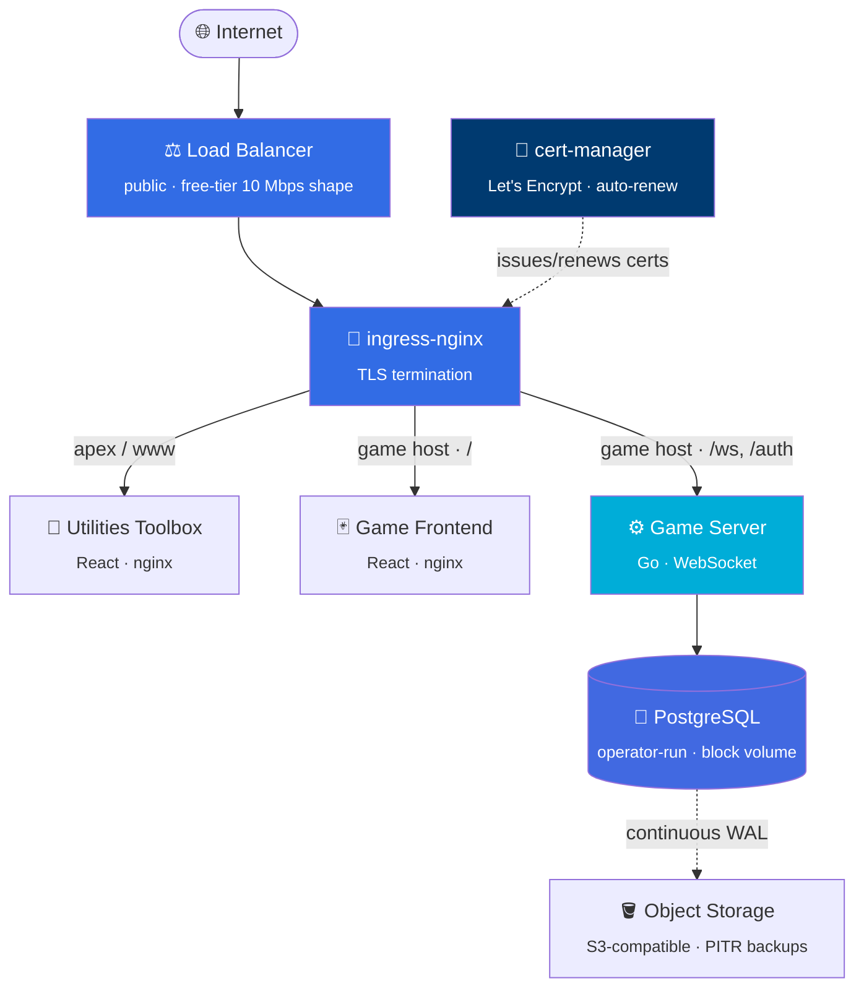

# ☁️ playground

**Building and operating a real production platform — from bare cloud account to a live, TLS-served, continuously-backed-up multiplayer app on Kubernetes.**

A case study, not a codebase. This repo documents the architecture, the decisions, and the production bugs worked through to get two products live on a managed cloud cluster.

 

---

## The one-paragraph version

Two small products — a real-time multiplayer card game and a browser-only developer-utilities toolbox — run on a **single always-free ARM node** in a managed Kubernetes cluster. Everything around them is production-grade and provisioned as code: a Terraform-built network and cluster, three least-privilege machine identities, a Trivy-gated CI/CD pipeline that cross-builds for ARM and blocks on real rollout success, ingress + auto-renewing TLS, an operator-run PostgreSQL with **continuous point-in-time backups**, and a full read-only diagnostics path for a cluster whose API server can't be reached directly. It's small on purpose — and operated like it isn't.

## Highlights

- 🏗️ **100% infrastructure-as-code** — network, cluster, node pool, and every IAM identity in Terraform. Nothing clicked into a console.
- 🔐 **Three least-privilege identities**, keys generated *in* Terraform and never typed by hand — the credential used most often holds the least power; the one living permanently in-cluster can touch the least.
- 🛡️ **Scan-before-push CI/CD** — images are cross-built for ARM, scanned for critical/high CVEs *before* reaching the registry, then deployed with the pipeline blocking on the rollout actually succeeding.
- 🔄 **Point-in-time database recovery** — continuous WAL archiving to object storage, not just nightly snapshots. Restore to any moment, not the last backup.
- 🐛 **Four latent production bugs found and fixed** getting it live — several that *only* a real deployment would ever surface (see below).
- 🔎 **Operated through pipelines, not a laptop** — the cluster API was unreachable directly for most of the build, so all ops run through CI, including a purpose-built read-only diagnostics workflow.

## Architecture

The game's frontend and API share **one hostname** on purpose: the browser derives its WebSocket URL from the page origin, so one image runs on any hostname, the login cookie is first-party, and CORS never engages in production.

## What was built

| Product | What it is | Stack |
| --- | --- | --- |
| 🃏 **Multiplayer card game** | Real-time [Big Two](https://en.wikipedia.org/wiki/Big_two) — a pure rules engine, a WebSocket server with matchmaking and bot fill-in, a browser table UI. Practice scoring only, no wagering. | Go · React · TypeScript |
| 🧰 **Developer utilities toolbox** | Nine browser-only tools: JSON/YAML tree editor, Base64/URL/JWT, regex tester, hash & UUID, timestamp & cron, QR codes, a WYSIWYG Markdown editor, a thumbnail grabber, an image converter. | React · TypeScript |

## Decisions that mattered

<table>
<tr><td>

**Everything on one cloud**

</td><td>

The server, both frontends, and the database all run on one cluster — one platform, one TLS setup, one deploy story — rather than scattering the static frontends to a separate host.

</td></tr>
<tr><td>

**Operator-run database**

</td><td>

An operator over a hand-rolled StatefulSet: a StatefulSet gets a *process* running, but not consistent backups, PITR, credential rotation, or safe upgrades. The operator encodes all of it.

</td></tr>
<tr><td>

**Kustomize + Helm split**

</td><td>

First-party manifests as Kustomize overlays; third-party add-ons (ingress, cert-manager, DB operator) via their own official Helm charts. The standard division.

</td></tr>
<tr><td>

**Pin what can cost money**

</td><td>

A `LoadBalancer` Service is one of the few Kubernetes objects that can quietly bill — its shape is pinned to the free-tier allowance (and flexible shapes bill on their *max*, so min and max are both pinned).

</td></tr>
</table>

## Bugs a real deployment surfaced

> The most valuable part of shipping to real infrastructure: the failures a green pipeline never shows you.

- **🏛️ Wrong CPU architecture** — images built for the x86-64 CI runner while the nodes are ARM; they'd fail at container start with `exec format error`. Hidden for weeks because a capacity-blocked node pool meant the pod never left `Pending`.
- **🍪 Insecure cookie behind the proxy** — the session cookie set `Secure` from whether the *server* saw TLS, but TLS terminates at the ingress, so every real cookie would've shipped insecure. Fixed via the forwarded-protocol header — safe because a spoof can only *add* the flag, never remove it.
- **✅ A pipeline that reported success while doing nothing** — a manual-dispatch run skipped its publish + deploy steps (wrong event-name gate), and a job of skipped steps reports green. Several "successful" runs deployed nothing. A green check that lies is worse than a red one.
- **🪣 Object-store chunked-encoding rejection** — backups failed with a buried `barman-cloud-wal-archive: exit status 4`; the real cause was the cloud's S3 API rejecting the AWS SDK's newer `aws-chunked` payload encoding. Reproduced *and* fixed against the live bucket before touching the cluster.

## How "done" was verified

A green pipeline proves the API accepted a desired state — not that anything works. The real acceptance checks:

- ✅ every hostname returns `200` to a **standard** client (no cert-verification bypass)
- ✅ the certificate issuer reads as the real authority, not the ingress placeholder
- ✅ a **full round of the game** played end-to-end over a real secure WebSocket, outcome persisted to the database
- ✅ an on-demand **backup verified to have written objects** to the bucket

*A played hand beats a green check.*

## Read more

| Doc | What's in it |
| --- | --- |
| 📐 [**Architecture**](docs/architecture.md) | The request path, network topology, TLS issuance, and why each layer exists. |
| 🛠️ [**Engineering highlights**](docs/engineering-highlights.md) | The decisions and the production bugs, in depth. |

---

The card game is deliberately practice-scoring only — no wagering, no payout, no cash-out anywhere in its API. A considered boundary, not an unfinished feature.

