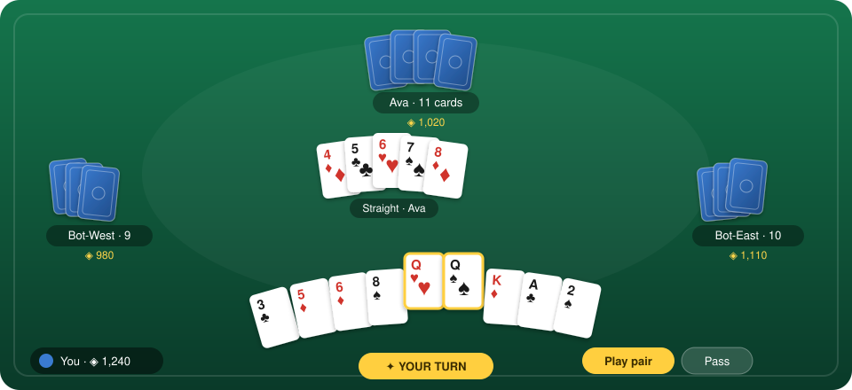
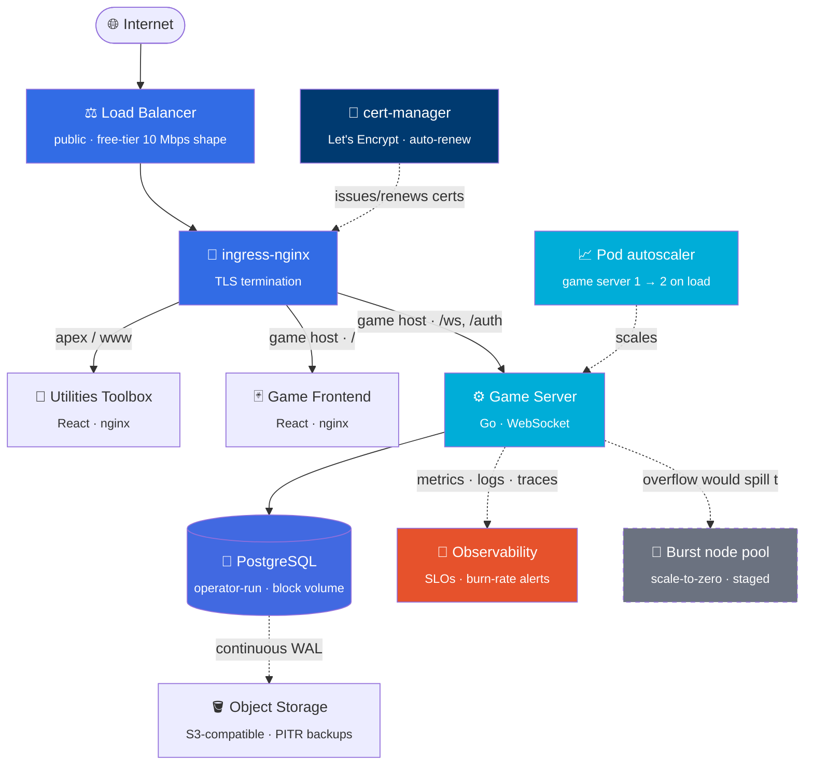
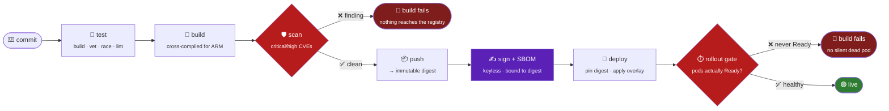

# ☁️ playground

**Building and operating a real production platform — from a bare cloud account to a live, TLS-served, continuously-backed-up multiplayer app on Kubernetes.**

A case study, not a codebase. This repo documents the architecture, the decisions, and the production bugs worked through to get two products live on a managed cloud cluster.

 

<i>The real-time table — your fanned hand, the live center pile, and three bot-filled seats (UI illustration).</i>

 

 

**What it demonstrates** — designing, shipping, *and operating* a full-stack system on Kubernetes: infrastructure as code, least-privilege identities, scan-gated CI/CD, point-in-time backups, bounded autoscaling, three pillars of observability, SLO burn-rate alerting, a signed supply chain, and operations run through pipelines rather than a laptop.

---

## The one-paragraph version

Two small products — a real-time multiplayer card game and a browser-only developer-utilities toolbox — run on a **single always-free ARM node** in a managed Kubernetes cluster. Everything around them is built the way a production system is built. The network, the cluster, and every machine identity are Terraform. The pipeline scans images before they reach the registry, signs what it ships, and refuses to call a deploy done until the pods are genuinely Ready. Postgres runs under an operator and streams its write-ahead log to object storage. Metrics, logs, and traces land in one pane, with error-budget burn-rate alerts on top. The game server drains in-flight hands on `SIGTERM` so elasticity never costs a player their game. It is small on purpose — and operated like it isn't.

## Twelve lines that survived contact with production

The whole case study compresses to twelve sentences. Each one was paid for by something going wrong.

1. **The credential you use most should reach the least.**
2. **A green check that lies is worse than a red one.**
3. **A played hand beats a green check** — verify the behaviour, not the API response.
4. **Scan before the push,** so what you scanned is exactly what ships.
5. **A snapshot restores to one instant; the log restores to any instant.**
6. **An untested backup is a hypothesis,** not a safety net.
7. **An autoscaler for pods cannot create capacity** — only nodes can.
8. **On a metered cloud, the `max` is the only thing that stops "scale up" meaning "spend."**
9. **A proxy's timeouts are part of your application's contract.**
10. **Monitoring that shares a failure domain with the thing it monitors** goes quiet exactly when you need it loudest.
11. **A retry loop that can't read the error will retry a bug forever.**
12. **Built is not shipped** — and the difference belongs in writing.

## Highlights

- 🏗️ **100% infrastructure as code.** Network, cluster, node pool, and every identity in Terraform. Nothing was clicked into a console.
- 🔐 **Three least-privilege identities**, their keys generated *inside* Terraform. The credential that runs on every push can touch one namespace. The one that lives permanently in the cluster can touch one bucket.
- 🛡️ **A pipeline of gates.** Cross-built for ARM, Trivy-scanned for critical CVEs *before* the registry, signed with keyless cosign and a Syft SBOM attached, then blocked on the rollout actually reporting Ready.
- 🧱 **A public edge hardened for the open internet.** Per-IP connection caps and token-bucket rate limits, capped frame sizes, read/write deadlines, and a ping/pong keepalive that reaps sockets whose clients vanished without a goodbye.
- 🔄 **Continuous WAL archiving to object storage** — the difference between losing a day and losing a few minutes. The restore drill is named as the next phase, not claimed as done.
- 📈 **Elastic, but bounded.** Overflow spills to a **scale-to-zero** burst node pool with a hard, documented cost ceiling. Idle costs `$0`. A graceful `SIGTERM` drain lets in-progress hands finish before a pod retires.
- 🔭 **All three observability pillars.** Prometheus and Grafana, Loki with an Alloy agent, OpenTelemetry into Tempo. RED signals *plus* game-domain gauges — hands in progress, human-versus-bot seats, join attempts by outcome. Metrics live on a port the public ingress cannot route to. Dashboards live in git.
- 🎯 **SLOs with multi-window burn-rate alerting.** Fast burn pages, slow burn tickets, and both windows must agree before either fires. Every alert names a symptom and links a runbook.
- 🛰️ **An external eye, outside the blast radius.** Every pillar above runs *inside* the cluster — so a node, balancer, ingress, DNS, or certificate failure would take the monitoring down with the site. A scheduled probe watches the public endpoints and certificate expiry from outside that failure domain and files a ticket when they break.
- 🧪 **Testing that crosses the real boundary.** Real sockets, real goroutines, a real Postgres in CI. Two genuine bugs were invisible to in-process fakes and surfaced only against a real connection.
- 🔎 **Operated through pipelines, not a laptop.** The cluster API was unreachable from the workstation for most of the build, so every operation runs through CI — including a purpose-built read-only diagnostics workflow.
- 🚧 **Honest about staged versus live.** GitOps with a metric-gated canary, default-deny network policies, and the node autoscaler are authored and validated but deliberately switched off. The table below says which is which.

## Architecture

The frontend and the API share **one hostname** on purpose. The browser derives its WebSocket URL from the page origin, so one built image runs on any hostname, the login cookie is first-party, and CORS never engages in production.

> **Say it in one line:** one front door, one certificate, one origin — and everything behind it is an internal detail.

### How code gets there

Every deploy is a pipeline, never a laptop. Each stage is a **gate that refuses to pass bad state downstream**, and the last gate is the only definition of "shipped" that means anything.

The scan runs **before** the push, so what was scanned is exactly what ships. The rollout gate is what makes the green check honest: an image that never becomes Ready fails the run instead of quietly leaving a dead pod behind.

> **Say it in one line:** every stage refuses to pass bad state downstream, and "deployed" means Ready, not accepted.

## What's live, what's staged, what's unproven

A portfolio that only lists wins is a portfolio you can't trust. This is the real state.

| | Capability | Status |
| --- | --- | --- |
| 🟢 | IaC, CI/CD with scan + rollout gates, ingress + auto-renewing TLS, operator-run Postgres, WAL archiving, three-pillar observability, an external synthetic monitor, SLO rules and routing, pod autoscaling, graceful drain, image signing + SBOM, Pod Security Standards at `baseline` | **Live** |
| 🟡 | GitOps with a metric-gated canary, default-deny network policies, the node autoscaler | **Authored and validated, deliberately off.** A canary needs a second pod the one baseline node can't fit; unenforced network policies would read as protection they don't provide. |
| 🔴 | A rehearsed database restore, an alert that actually reached a human, the load test that right-sizes the autoscaler | **Not yet proven.** Backups are verified to write objects but no restore has been performed. Alert delivery is wired to a chat bot but has never fired in anger. The k6 test is written; the autoscaler's CPU target is still a committed placeholder. |

> **Say it in one line:** built, staged, and unproven are three different words, and using them precisely is the whole discipline.

## What was built

| Product | What it is | Stack |
| --- | --- | --- |
| 🃏 **Multiplayer card game** | Real-time [Big Two](https://en.wikipedia.org/wiki/Big_two) — a pure rules engine, a WebSocket server with matchmaking and bot fill-in, a browser table UI. Two passwordless login paths, a bilingual interface, and a speech-synthesis dealer that calls each play aloud. Practice scoring only, no wagering. | Go · React · TypeScript |
| 🧰 **Developer utilities toolbox** | Nine browser-only tools: JSON/YAML tree editor, Base64/URL/JWT, regex tester, hash & UUID, timestamp & cron, QR codes, a WYSIWYG Markdown editor, a thumbnail grabber, an image converter. Every one runs entirely client-side — nothing uploaded. | React · TypeScript |

Two product details worth their own line, because both were judgement calls rather than features:

- **No passwords anywhere.** Two doors — a one-time magic link and a signed chat-platform mini-app payload — converge on one session cookie set in exactly one place. Nothing to hash, rate-limit, or leak, because there is no password.
- **The interface speaks the player's language.** A second locale in the game's *colloquial* register, auto-selected from the device's own signals with a manual override — and the dealer reads each play aloud through the browser's speech synthesis, with no audio files and no network call.
- **You play with the people you came with.** Launched from a group conversation, the game seats that chat together — but the key is a *preference*, not a partition: unfilled tables merge with each other after a few seconds, and only then is filling the empty seats with bots offered. Never seating anyone is worse than seating them with strangers.

## Decisions that mattered

<table>
<tr><td>

**Everything on one cloud**

</td><td>

The server, both frontends, and the database run on one cluster. One platform, one TLS setup, one deploy story — instead of scattering the static frontends to a separate host.

</td></tr>
<tr><td>

**Operator-run database**

</td><td>

An operator over a hand-rolled StatefulSet. A StatefulSet gets a *process* running. It does not give you consistent backups, point-in-time recovery, credential rotation, or safe upgrades. The operator encodes all of it.

</td></tr>
<tr><td>

**Kustomize + Helm split**

</td><td>

First-party manifests as Kustomize overlays. Third-party add-ons through their own official Helm charts. The standard division, not a preference.

</td></tr>
<tr><td>

**Pin what can cost money**

</td><td>

A `LoadBalancer` Service is one of the few Kubernetes objects that can quietly bill. Its shape is pinned to the free-tier allowance — and because flexible shapes bill on their *maximum*, min and max are both pinned.

</td></tr>
<tr><td>

**Autoscale, but cap the bill**

</td><td>

Overflow spills to a scale-to-zero burst pool whose hard `max` *is* the money cap. Idle costs nothing and a runaway workload cannot spend past a known ceiling. The thresholds are still placeholders, and they are labelled as placeholders in the manifest.

</td></tr>
<tr><td>

**Alert on burn rate, not thresholds**

</td><td>

Error budgets over static thresholds. Fast burn pages, slow burn tickets, and each needs a long *and* a short window to agree. A blip can't page, and a slow bleed isn't slept through. Every alert names a symptom and links a runbook.

</td></tr>
<tr><td>

**Test the real boundary**

</td><td>

Anything crossing a socket, a goroutine, a timer, or a database gets at least one test against the real thing. A mock encodes your assumptions; a real socket encodes reality. Two real bugs were invisible to fakes and surfaced only over a live connection.

</td></tr>
<tr><td>

**Stage what the cluster can't hold**

</td><td>

GitOps with a metric-gated canary, default-deny network policies, and node autoscaling are authored and validated but switched **off**. Claiming less than you built beats a demo that looks live.

</td></tr>
</table>

## Bugs a real deployment surfaced

> The most valuable part of shipping to real infrastructure: the failures a green pipeline never shows you.

- **🏛️ The images were built for the wrong CPU.** Runners are x86-64; the nodes are ARM. Every image would have died at container start with `exec format error`. It hid for weeks, because a capacity-blocked node pool meant the pod never left `Pending` — there was no running node to fail on.
- **🍪 The session cookie was insecure behind the proxy.** It set `Secure` from whether the *server* saw TLS. But TLS ends at the ingress, so the server always sees plain HTTP. Every real cookie would have shipped without the flag. The fix reads the forwarded-protocol header — safe here because a spoof can only *add* the flag, never remove it.
- **✅ A pipeline reported success while doing nothing.** A manual run skipped its publish and deploy steps on a wrong event-name gate — and a job made entirely of skipped steps reports **green**. Several "successful" runs deployed nothing at all.
- **⏱️ A sixty-second proxy default was ending games.** Players waiting at an unfilled table dropped with a bare "Connection closed." and *no server-side error*, because nothing had failed. The ingress closes a connection idle for 60 seconds — right for HTTP, exactly wrong for a long-lived WebSocket.
- **📉 The monitoring stack didn't fit, and the installer said it did.** The install returned green while Prometheus sat `Pending` for **23 hours**. The chart's wait only covers its own resources; the operator creates the real pod *afterwards*. An unsatisfiable request isn't an error — it's a pod waiting politely, forever.
- **🔒 A one-line hardening took the site down — twice.** A read-only root filesystem shipped, the rollout never went Ready, and the game served `503` while the static frontend still served `200`. Half-up looks fine and isn't. In the same batch, declaring "run as non-root" without a *numeric* user id meant the kubelet couldn't verify the claim and refused the container outright. Both reverted, both written up the same day.
- **🪣 Object storage rejected the backup writer's encoding.** Backups failed with a buried `exit status 4`; the real cause was the cloud's S3 API refusing the AWS SDK's newer chunked payload encoding. Reproduced *and* fixed against the live bucket before touching the cluster.
- **📡 A Ready pod can still be wired wrong.** A trace datasource was pointed at the log store's port. The install was green, the pod was Ready, and every query returned nothing. Confirm ports from the resource, not from muscle memory.
- **🧵 A flaky test where both outcomes were correct.** A test asserted the server drops an oversized frame — but the client's write and the server's close are two ends of one socket racing. Either side can win, and *both* prove the cap held. The test was accepting one of two correct answers.

## How "done" was verified — and what isn't

A green pipeline proves the API accepted a desired state. It does not prove anything works. What was actually checked:

- ✅ every hostname returns `200` to a **standard** client, with no certificate-verification bypass
- ✅ the certificate issuer reads as the real authority, not the ingress placeholder
- ✅ a **full round of the game** played end to end over a real secure WebSocket, with the outcome persisted to the database
- ✅ an on-demand **backup verified to have written objects** to the bucket

And what is deliberately *not* claimed:

- ❌ no restore has ever been performed from those backups
- ❌ no alert has ever been delivered to a human in anger
- ❌ the load test that would right-size the autoscaler has not been run

*A played hand beats a green check — and an unrehearsed restore is a hypothesis, not a backup.*

## Read more

| Doc | What's in it |
| --- | --- |
| 📐 [**Architecture**](docs/architecture.md) | The request path, network topology, identity rings, TLS issuance, data durability, scaling, observability, delivery, and hardening — with the diagrams. |
| 🛠️ [**Engineering highlights**](docs/engineering-highlights.md) | The decisions, the production bugs in depth, and an explicit list of what remains unproven. |

---

The card game is deliberately practice-scoring only — no wagering, no payout, no cash-out anywhere in its API. A considered boundary, not an unfinished feature.

